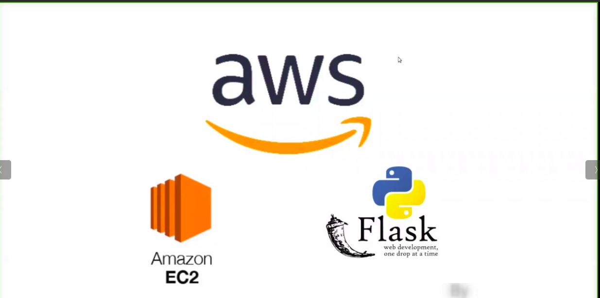

# flask-ec2-deployment
> This is a simple flask application that shows how to deploy a production grade application to AWS EC2.

[![security: bandit][bandit-image]][bandit-url]
[![Imports: isort][isort-image]][isort-url]

This project shows how to lauch a production grade application to AWS EC2. It is a simple flask application, with a single route that is used for test purposes. If you want to learn more about how it was developed, read [How to Deploy a Production Grade Flask application to an AWS EC2 Instance using GitHub Actions](https://medium.com/@lyle-okoth/how-to-deploy-a-production-grade-flask-application-to-an-aws-ec2-instance-using-github-actions-6241886b197) The are atleast five branches associated with the application:
- **Features** - Used to create new features
- **Development** - Where all the newly developed features are showcased
- **Staging** - Used to test out the nwely developed features before being moved to production
- **Release** - Holds all the code and assets related to the latest release
- **Production** - Holds all the code that is currentlyin production.

Still under development.

<!-- Markdown link & img dfn's -->
[wiki]: https://github.com/yourname/yourproject/wiki

[bandit-image]: https://img.shields.io/badge/security-bandit-yellow.svg
[bandit-url]: https://github.com/PyCQA/bandit

[isort-image]: https://img.shields.io/badge/%20imports-isort-%231674b1?style=flat&labelColor=ef8336
[isort-url]: https://pycqa.github.io/isort/
